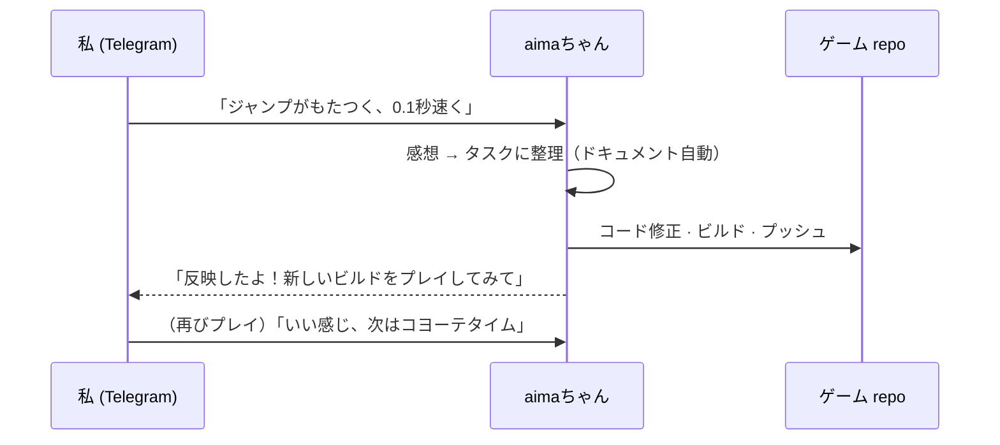

# aima-framework

🌏 [한국어](README.md) · [日本語](README.ja.md)

**カスタムライブラリエンジン + `aimaちゃん` チャットボット** からなる、ゲーム開発のワークフローそのものを変えるためのフレームワーク。
[arimu](https://github.com/jungminna03/arimu-framework)（EnTT ベースの ECS）をコアとして包み、
クロスプラットフォームビルド · ホストループ · ホットリロード · SDL3 プラットフォーム層 · 抽象 **Renderer インターフェース** を
ひとつのエンジンにまとめ、その上に Telegram チャットボット **aimaちゃん** を乗せている。

## なぜ作ったか — ワークフローをひっくり返すため

従来のゲーム開発はたいてい **ドキュメント作業 → 実装** の順だ。企画書を書き、仕様をまとめ、
それからようやくコードを書く。けれどゲームは *実際にプレイしてみるまで* 何が面白いか分からない。
どれだけ丁寧にドキュメントを書いても、手に取って触ってみれば半分は外れている。

だから順番をひっくり返したかった — **実装 → フィードバック → 実装** のループに。まずプロトタイプを
動かしてみて、プレイした感想を投げると、その感想がそのまま次の実装につながる流れ。**ドキュメント作業は
人が前もってやるのではなく、このループの中で自動的についてくる** ようにする。

そのループを人が手で回すと結局遅くなるので、その役割をチャットボット **aimaちゃん** が埋める。

## aimaちゃん — 感想を実装に変えるチャットボット

```
プロトタイプをプレイ  →  Telegram に感想を投げる  →  aimaちゃん
                                                       │
                          感想を整理（＝ドキュメント自動生成）│
                                                       ▼
                                              実際のコード実装 · ビルド · プッシュ
                                                       │
                                                       ▼
                                              新しいプロトタイプを再びプレイ  ⟲
```

1. **プロトタイプをプレイ**してみる。
2. 感じたことを **Telegram グループに自然言語で** 投げる。（「ジャンプがもたつく」「ボスのパターンを一拍速く」…）
3. **aimaちゃん** がその感想を **整理（ドキュメント化）** し、**実際の実装まで** 行う — コード修正 → ビルド → プッシュ。
4. 新しくビルドされたプロトタイプを **再びプレイ** → 感想 → 実装。ループが回り続ける。

ドキュメントは「書く作業」ではなく、**ループが残していく副産物** になる。

### 実際の動作

> 🖼️ **デモキャプチャ追加予定** — Telegram グループで自然言語の感想を投げると、aimaちゃんがそれを
> タスクとして整理し、実際にコードを修正・ビルド・プッシュするチャットキャプチャがここに入ります。
> 画像を `docs/aima-chan-demo.png` として追加すれば、下の行のコメントを外すだけで表示されます。

<!--  -->



> **レンダラーは入っていない。** エンジンは何も描かない — 各ゲームが `aima::Renderer` を
> 自分のグラフィックで実装する（3D、2D、単純な SDL clear、何でも）。だからどんなジャンルでも同じ土台を使う。

## 1フォルダのコピペで新しいゲームを始める

```
MyGame/                    ← IDE で開く「自分のゲーム」フォルダ（名前は自由）
├─ aima_framework/         ← このフォルダを丸ごとコピペ（純粋エンジン + tools、絶対に触らない）
├─ game/                   ← setup が生成する。ゲームロジック = ここ（aima_framework の外）
├─ CMakeLists.txt          add_subdirectory(aima_framework) + game ビルド
├─ CMakePresets.json · vcpkg.json · .vscode/ · .run/ · third_party/ · aima.project.json
└─ build/                  （ビルド成果物）
```

**流れ:**
1. `MyGame` フォルダを作る。
2. **`aima_framework` フォルダをその中にコピペ。**
3. **`aima_framework/tools/setup`** をクリック → 親 `MyGame` がビルド可能なゲームプロジェクトに変身
   （ゲームスケルトンが `MyGame/game/` に生成され、ツールチェーン·vcpkg インストール、IDE 起動、**黒い窓** ビルド）。
   - macOS: `tools/setup-mac.command` · Windows: `tools/setup.bat`
4. **`aima_framework/tools/issue-token`** をクリック → トークン発行。
5. Telegram グループで **`/bind <トークン>`** → この部屋 ↔ このゲームを接続。
6. あとは **しゃべれば aimaちゃんが `MyGame/game/` を実装し始める** — 実装 → フィードバック → 実装ループ開始。

> ゲームロジックは **常に `MyGame/game/`（＝ aima_framework の外）** にある。`aima_framework/` は
> 純粋な依存なので絶対に変更しない — 新バージョンが出たらフォルダごと差し替えるだけ。

## フォルダの中身 (aima_framework/)

```
aima_framework/
├─ CMakeLists.txt           # エンジンライブラリ（add_subdirectory で取り込む、NO renderer）
├─ CMakePresets.json        # Windows / macOS / Linux プリセット
├─ vcpkg.json               # 汎用 deps（グラフィックライブラリなし; Jolt 物理オプション）
├─ include/aima/            # aima.h · renderer.h（インターフェース）· host.h（ループ + モジュール ABI）
├─ src/                     # core(log/math/hot_reload/host) · platform(window/input/audio) · assets
├─ arimu-framework/         # 内蔵 Arimu ECS (+ EnTT) — github.com/jungminna03/arimu-framework
├─ USAGE_FOR_AI.md          # AI/開発者向け詳細マニュアル（Renderer インターフェース·ABI·ホットリロード）
└─ tools/
   ├─ setup-mac.command/.sh · setup-windows.ps1 · setup.bat   ← 親をプロジェクトへスキャフォールド
   ├─ issue-token.command/.sh/.bat · issue_token.py           ← トークン発行（親を登録）
   └─ template/             ← setup が親(MyGame)へ生成するスケルトン
```

## アーキテクチャ一望

```
   aimaちゃん (telegram)  ── 感想 → 整理(自動ドキュメント) → 実装 → ビルド → プッシュ ⟲
        │
        ▼
   your game/ (game logic)         ← ホットリロードされるゲームモジュール（aima_framework の外）
        │  implements aima::Renderer, App::Tick, GameServiceFrame
        ▼
   aima エンジン  ── host loop · hot-reload · SDL3 platform(window/input/gamepad/audio) · assets
        │
        ▼
   arimu (ECS)  ── World · Schedule · System · Query · Resource · Event · Commands  （EnTT の上）
```

ゲームは毎フレーム、ホストが呼ぶ `App::Tick(dt)` と（任意の）`GameServiceFrame` フックで ECS を
回し、`aima::Renderer` 実装で描画する。入力はキーボード·マウス·ゲームパッドがひとつの
`InputState` にまとめられて入ってくる。

> **私の役割 — 設計者。** このシステムを構築するにあたり、エンジン内部のコード実装の大部分は AI に
> 任せ、私は **Telegram API ↔ LLM をつなぐパイプライン設計とプロンプト最適化（Prompt
> Engineering）に集中** した。「どうしゃべればどんな実装が出てくるか」を決める境界面 — 感想を
> 構造化されたタスク指示に変えるプロンプト、ビルド・プッシュまでつながる自動化パイプライン — が
> 私自身が設計した核心だ。

## IN vs 除外

**IN:** クロスプラットフォームビルド + 汎用ライブラリ（SDL3, spdlog, efsw, nlohmann_json, tomlplusplus,
DirectXMath, EnTT via Arimu; Jolt オプション）+ ホストループ + コード·アセットのホットリロード + プラットフォーム層
（ウィンドウ·入力·ゲームパッド·オーディオ）+ ECS + **Renderer インターフェース** + **aimaちゃん チャットボットワークフロー**。

**除外（ゲームが供給）:** 具体的なレンダラー / GPU デバイス / パス / シェーダー、GPU アセットローダー、imgui、
DX12/SDL_GPU — つまりすべてのグラフィック。

## setup オプション

- mac: `--skip-build` · `--skip-install` · `--ide vscode|clion|xcode|none` · `--no-open`
- win: `-Config release` · `-Ide vscode|clion|vs|none` · `-SkipBuild`

詳細な契約（Renderer インターフェース·ゲームモジュール ABI·ホットリロード·新規プロジェクト）は [`USAGE_FOR_AI.md`](USAGE_FOR_AI.md)、
ECS は [`arimu-framework/USAGE_FOR_AI.md`](arimu-framework/USAGE_FOR_AI.md) を参照。

---

<sub>📝 この README は AI が制作・修正しています。</sub>
