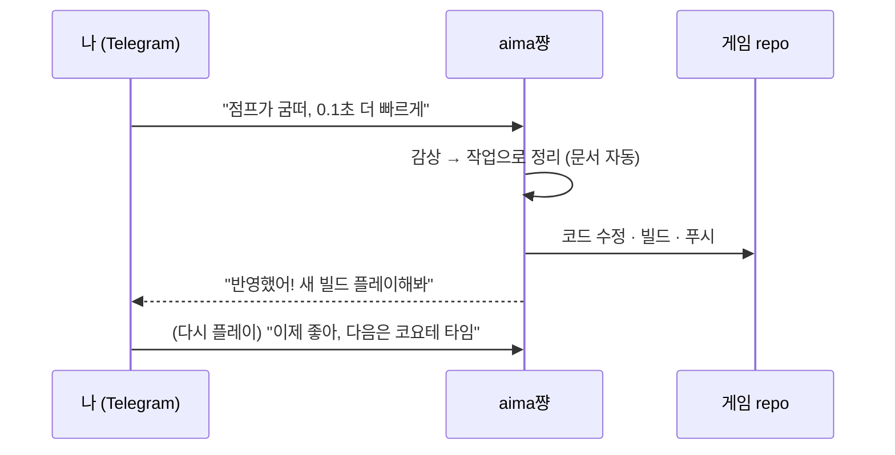

# aima-framework

🌏 [English](README.md) · [日本語](README.ja.md)

**커스텀 라이브러리 엔진 + `aima쨩` 챗봇** 으로 이루어진, 게임 개발 워크플로우 자체를 바꾸기 위한 프레임워크.
[arimu](https://github.com/jungminna03/arimu-framework)(EnTT 기반 ECS)를 코어로 감싸,
크로스플랫폼 빌드 · 호스트 루프 · 핫리로드 · SDL3 플랫폼 계층 · 추상 **Renderer 인터페이스**를
하나의 엔진으로 묶고, 그 위에 텔레그램 챗봇 **aima쨩** 을 얹었다.

## 왜 만들었나 — 워크플로우를 뒤집기 위해

기존 게임 개발은 보통 **문서 작업 → 구현** 순서다. 기획서를 쓰고, 명세를 정리하고, 그 다음에야
코드를 짠다. 그런데 게임은 *직접 플레이해 보기 전까지는* 무엇이 재미있는지 알 수 없다. 문서를
아무리 정성껏 써도, 손에 쥐고 만져보면 절반은 틀린다.

그래서 순서를 뒤집고 싶었다 — **구현 → 피드백 → 구현** 의 루프로. 일단 프로토타입을 굴려보고,
플레이한 감상을 던지면, 그 감상이 곧바로 다음 구현으로 이어지는 흐름. **문서 작업은 사람이 앞에서
하는 게 아니라, 이 루프 안에서 자동으로 따라오게** 만든다.

그 루프를 사람이 손으로 돌리면 결국 느려지니까, 그 자리를 챗봇 **aima쨩** 으로 메웠다.

## aima쨩 — 감상을 구현으로 바꾸는 챗봇

```
프로토타입 게임 플레이  →  텔레그램에 감상 던지기  →  aima쨩
                                                       │
                          감상 정리 (= 문서가 자동 생성)  │
                                                       ▼
                                              실제 코드 구현 · 빌드 · 푸시
                                                       │
                                                       ▼
                                              새 프로토타입을 다시 플레이  ⟲
```

1. **프로토타입을 플레이**해 본다.
2. 느낀 점을 **텔레그램 그룹에 자연어로** 던진다. ("점프가 굼떠", "보스 패턴 한 박자 빠르게", …)
3. **aima쨩** 이 그 감상을 **정리(문서화)** 하고, **실질적인 구현까지** 수행한다 — 코드 수정 → 빌드 → 푸시.
4. 새로 빌드된 프로토타입을 **다시 플레이** → 감상 → 구현. 루프가 계속 돈다.

문서는 "쓰는 일"이 아니라 **루프가 남기는 부산물**이 된다.

### 실제 동작

> 🖼️ **데모 캡처 추가 예정** — 텔레그램 그룹에서 자연어 감상을 던지면 aima쨩이 이를 작업으로
> 정리하고 실제 코드를 수정·빌드·푸시하는 채팅 캡처가 여기에 들어갑니다.
> 이미지를 `docs/aima-chan-demo.png` 로 추가하면 아래 줄의 주석을 해제해 바로 표시됩니다.

<!--  -->



> **렌더러는 안 들어있다.** 엔진은 아무것도 안 그린다 — 각 게임이 `aima::Renderer` 를
> 자기 그래픽으로 구현한다(3D, 2D, 단순 SDL clear, 무엇이든). 그래서 어떤 장르든 같은 토대를 쓴다.

## 한 폴더 복붙으로 새 게임 시작

```
MyGame/                    ← IDE에서 여는 "내 게임" 폴더 (이름은 자유)
├─ aima_framework/         ← 이 폴더를 통째로 복붙 (순수 엔진 + tools, 절대 안 건드림)
├─ game/                   ← setup이 찍어줌. 게임 로직 = 여기 (aima_framework 밖)
├─ CMakeLists.txt          add_subdirectory(aima_framework) + game 빌드
├─ CMakePresets.json · vcpkg.json · .vscode/ · .run/ · third_party/ · aima.project.json
└─ build/                  (빌드 산출물)
```

**흐름:**
1. `MyGame` 폴더 만들기.
2. **`aima_framework` 폴더를 그 안에 복붙.**
3. **`aima_framework/tools/setup`** 클릭 → 부모 `MyGame` 이 빌드되는 게임 프로젝트로 변신
   (게임 스켈레톤이 `MyGame/game/` 에 찍히고, 툴체인·vcpkg 설치, IDE 열림, **검은 창** 빌드).
   - macOS: `tools/setup-mac.command` · Windows: `tools/setup.bat`
4. **`aima_framework/tools/issue-token`** 클릭 → 토큰 발급.
5. 텔레그램 그룹에서 **`/bind <토큰>`** → 이 방 ↔ 이 게임 연결.
6. 이제 **떠들면 aima쨩이 `MyGame/game/` 을 구현하기 시작** — 구현 → 피드백 → 구현 루프 시작.

> 게임 로직은 **항상 `MyGame/game/` (= aima_framework 밖)** 에 있다. `aima_framework/` 는
> 순수 의존성이라 절대 수정하지 않는다 — 새 버전이 나오면 폴더째 교체만 하면 된다.

## 폴더 안 (aima_framework/)

```
aima_framework/
├─ CMakeLists.txt           # 엔진 라이브러리 (add_subdirectory 로 끌어씀, NO renderer)
├─ CMakePresets.json        # Windows / macOS / Linux 프리셋
├─ vcpkg.json               # 범용 deps (그래픽 라이브러리 없음; Jolt 물리 옵션)
├─ include/aima/            # aima.h · renderer.h(인터페이스) · host.h(루프+모듈 ABI)
├─ src/                     # core(log/math/hot_reload/host) · platform(window/input/audio) · assets
├─ arimu-framework/         # 내장 Arimu ECS (+ EnTT) — github.com/jungminna03/arimu-framework
├─ USAGE_FOR_AI.md          # AI/개발자용 상세 매뉴얼 (Renderer 인터페이스·ABI·핫리로드)
└─ tools/
   ├─ setup-mac.command/.sh · setup-windows.ps1 · setup.bat   ← 부모를 프로젝트로 스캐폴딩
   ├─ issue-token.command/.sh/.bat · issue_token.py           ← 토큰 발급(부모 등록)
   └─ template/             ← setup이 부모(MyGame)로 찍어내는 스켈레톤
```

## 아키텍처 한눈에

```
   aima쨩 (telegram)  ── 감상 → 정리(자동 문서) → 구현 → 빌드 → 푸시 ⟲
        │
        ▼
   your game/ (game logic)         ← 핫리로드되는 게임 모듈 (aima_framework 밖)
        │  implements aima::Renderer, App::Tick, GameServiceFrame
        ▼
   aima 엔진  ── host loop · hot-reload · SDL3 platform(window/input/gamepad/audio) · assets
        │
        ▼
   arimu (ECS)  ── World · Schedule · System · Query · Resource · Event · Commands  (EnTT 위)
```

게임은 매 프레임 호스트가 부르는 `App::Tick(dt)` 과(선택) `GameServiceFrame` 훅에서 ECS를
돌리고, `aima::Renderer` 구현으로 그린다. 입력은 키보드·마우스·게임패드가 하나의
`InputState` 로 합쳐져 들어온다.

> **내 역할 — 설계자.** 이 시스템을 구축하면서 엔진 내부 코드 구현의 상당 부분은 AI에 맡기고,
> 나는 **Telegram API ↔ LLM 을 잇는 파이프라인 설계와 프롬프트 최적화(Prompt Engineering)에
> 집중**했다. "어떻게 떠들면 어떤 구현이 나오는가"를 결정하는 경계면 — 감상을 구조화된 작업
> 지시로 바꾸는 프롬프트, 빌드·푸시까지 이어지는 자동화 파이프라인 — 이 내가 직접 설계한 핵심이다.

## IN vs 제외

**IN:** 크로스플랫폼 빌드 + 범용 라이브러리(SDL3, spdlog, efsw, nlohmann_json, tomlplusplus,
DirectXMath, EnTT via Arimu; Jolt 옵션) + 호스트 루프 + 코드·에셋 핫리로드 + 플랫폼 계층
(윈도우·입력·게임패드·오디오) + ECS + **Renderer 인터페이스** + **aima쨩 챗봇 워크플로우**.

**제외(게임이 공급):** 구체 렌더러 / GPU 디바이스 / 패스 / 셰이더, GPU 에셋 로더, imgui,
DX12/SDL_GPU — 즉 모든 그래픽.

## setup 옵션

- mac: `--skip-build` · `--skip-install` · `--ide vscode|clion|xcode|none` · `--no-open`
- win: `-Config release` · `-Ide vscode|clion|vs|none` · `-SkipBuild`

상세 계약(Renderer 인터페이스·게임 모듈 ABI·핫리로드·새 프로젝트)은 [`USAGE_FOR_AI.md`](USAGE_FOR_AI.md),
ECS는 [`arimu-framework/USAGE_FOR_AI.md`](arimu-framework/USAGE_FOR_AI.md) 참고.

---

<sub>📝 이 README는 AI가 제작·수정하고 있습니다.</sub>
